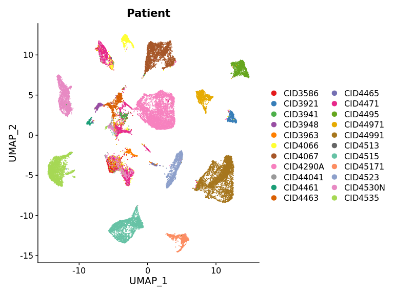
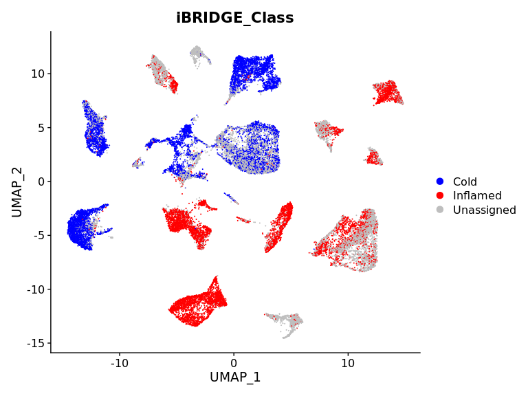

iBRIDGE integrates bulk and single-cell datasets to profile granular heterogeneity of TIME
================
Tolga Turan
February 1, 2022

## INTRODUCTION:

Quantification of T cell infiltration levels in a tumor tissue, is an important component of Immuno-Oncology research. In bulk gene expression datasets, this can be approximated by using "Gene Set Enrichment" or "Cell Type Deconvolution" methods (with gene signatures such as ICR, TIS or IFNG, etc. ). However, reaching the same goal is not straigthforward in single-cell RNAseq datasets. Here, we report a novel method "iBRIDGE" that can integrate and *bridge* between bulk and single-cell gene expression data types to quantify T cell infiltration levels and classify the patients as "inflamed", "cold" or "unassigned/intermediate".

## INSTALLATION:

Install iBRIDGE and the packages it depends as follows:

``` {.r}
library(devtools)
install.packages("Seurat")
BiocManager::install(c("AUCell", "BiocParallel"))
Sys.setlocale("LC_ALL","en_US.UTF-8")
install_github("tolgaturan-github/IBRIDGE")
```

## USAGE:

As explained in the associated publication, malignant cancer cells are the only subpopulation that clusters by patient group. Therefore, we hypothesize that 'malignant' population can be used to assess T-cell infiltration levels from scRNASeq data by integrating the correlates of T-cell infiltration from the corresponding TCGA cohort. In this vignette, we utilized a Breast Cancer scRNAseq dataset (GSE176078) reported by Wu et al., 2021, to describe the iBRIDGE workflow.

Load necessary packages, the geneXcell count matrix and the patient metadata for the malignant subset of this dataset. Below test data are used to replicate this vignette. Instead of full counts only the matrix with top 3000 variable genes are included in the iBRIDGE package (due to GitHub space restrictions, however, both inputs generated identical results).

``` {.r}
library(IBRIDGE)
library(Seurat)
data("GSE176078_malignant_UMI_countmatrix", "GSE176078_malignant_metadata", package="IBRIDGE")

dim(GSE176078_malignant_UMI_countmatrix)
```

    ## [1]  3000 27915

``` {.r}
GSE176078_malignant_UMI_countmatrix[1:6, 1:6]
```

    ##        CID3586_TTCTCCTTCTGAAAGA CID3586_AACCATGGTTCAGGCC
    ## A2M                           0                        3
    ## AAMDC                         0                        0
    ## AARD                          0                        0
    ## ABCA12                        0                        0
    ## ABCB1                         0                        0
    ## ABCC11                        0                        0
    ##        CID3586_AACCGCGAGCGATGAC CID3586_AAGGAGCCATCTGGTA
    ## A2M                           0                        4
    ## AAMDC                         0                        0
    ## AARD                          0                        0
    ## ABCA12                        0                        0
    ## ABCB1                         0                        0
    ## ABCC11                        0                        0
    ##        CID3586_AAGGCAGAGATCCGAG CID3586_AAGTCTGAGCCAACAG
    ## A2M                           2                        0
    ## AAMDC                         1                        0
    ## AARD                          0                        0
    ## ABCA12                        0                        0
    ## ABCB1                         0                        0
    ## ABCC11                        0                        0

``` {.r}
table(GSE176078_malignant_metadata$Patient)
```

    ## 
    ##  CID3586  CID3921  CID3941  CID3948  CID3963  CID4066  CID4067 CID4290A 
    ##      698      442      197      261      221      786     2355     4082 
    ## CID44041  CID4461  CID4463  CID4465  CID4471  CID4495 CID44971 CID44991 
    ##      151      207      685      137     2178     1150     1622     4001 
    ##  CID4513  CID4515 CID45171  CID4523 CID4530N  CID4535 
    ##        8     2205      815     1170     2134     2410

Normalize count matrix using SCTransform based on Seurat workflow.

``` {.r}
seu1<-SCTransform_normalization(GSE176078_malignant_UMI_countmatrix, GSE176078_malignant_metadata$Patient)
```

To show that malignant population of single-cells clusters by patient, we can visualize patients vs. UMAP dimensions:

``` {.r}
library(ggplot2)
library(RColorBrewer)
DimPlot(seu1, group.by="Patient", size=0.5)+scale_colour_manual(values=c(brewer.pal(9, "Set1"), brewer.pal(8, "Dark2"), brewer.pal(5, "Set2")))
```



Now, let's identify iBRIDGE overlaps between single-cell and bulk expression data. Since this is a BRCA dataset, we pull TCGA features that correlate with inflamed and cold TCGA-BRCA samples. Then we can identify top highly variable genes form the single-cell data:

``` {.r}
iBRIDGE_features<-IBRIDGE_overlaps(seu1, "gene", "BRCA", "SCTransform")
lapply(iBRIDGE_features, head)
```

    ## $inflamed
    ## [1] "B2M"    "HLA-C"  "HLA-B"  "HLA-A"  "MUCL1"  "CALML5"
    ## 
    ## $cold
    ## [1] "NEAT1"   "COX6C"   "AZGP1"   "AGR2"    "PIP"     "SLC39A6"

After identifying the features we can apply geneset enrichment to see which of the cancer cells express inflamed/cold features. Then we can assign an inflamed/cold classification to each of the cells:

``` {.r}
seu1<-Classify_cells(seu1, iBRIDGE_features, "SCTransform", 100)
```

``` {.r}
table(seu1@meta.data$iBRIDGE_Class)
```

    ## 
    ##       Cold   Inflamed Unassigned 
    ##       8626       8624      10665

We can then visualize these classes on the UMAP dimensions:

``` {.r}
library(ggplot2)
DimPlot(seu1, group.by="iBRIDGE_Class", size=0.5)+scale_colour_manual(values=c("blue", "red", "gray"))
```



Average per-patient iBRIDGE scores can be used to quantify immune-infiltration levels.

``` {.r}
cell_metadata<-data.frame(Patient=seu1@meta.data$Patient,iBRIDGE_Score=seu1@meta.data$iBRIDGE_Score, iBRIDGE_Class=seu1@meta.data$iBRIDGE_Class)
cell_metadata<-cell_metadata[!is.infinite(cell_metadata$iBRIDGE_Score),]
patient_metadata<-data.frame(Patient=levels(factor(cell_metadata$Patient)), ave_iBRIDGE_Score=sapply(split(cell_metadata$iBRIDGE_Score, cell_metadata$Patient), mean))
patient_metadata[order(patient_metadata$ave_iBRIDGE_Score),2, drop=FALSE ]
```

    ##          ave_iBRIDGE_Score   absolute_classification
    ## CID4067          0.2844366   below_threshold
    ## CID4290A         0.3190990   below_threshold
    ## CID4463          0.3359717   below_threshold
    ## CID3941          0.3426980   below_threshold
    ## CID4535          0.3503089   below_threshold
    ## CID3948          0.3997413   below_threshold
    ## CID4461          0.7474839   below_threshold
    ## CID4530N         0.9168359   below_threshold
    ## CID44041         1.1634709   below_threshold
    ## CID45171         1.8677005   above_threshold
    ## CID4471          1.8999504   above_threshold
    ## CID44991         1.9804435   above_threshold
    ## CID4066          2.0354404   above_threshold
    ## CID3921          2.4829418   above_threshold
    ## CID4465          2.5587411   above_threshold
    ## CID44971         3.0594636   above_threshold
    ## CID4523          4.1963778   above_threshold
    ## CID4513          5.1243847   above_threshold
    ## CID4495          5.3834998   above_threshold
    ## CID4515          6.2507787   above_threshold
    ## CID3586          6.4514996   above_threshold
    ## CID3963          8.0389367   above_threshold

Further visualization of per-cell scoress and classes asa boxplot:

``` {.r}
ggplot(cell_metadata,aes(x=iBRIDGE_Class, y=iBRIDGE_Score, fill=iBRIDGE_Class))+geom_boxplot(outlier.shape=NA)+scale_fill_manual(values=c("blue", "red", "gray"))+scale_y_continuous(limits = c(0, 12))
```


References:

Wu SZ, Al-Eryani G, et al. **A single-cell and spatially resolved atlas of human breast cancers.** *Nat Genet. 2021 Sep;53(9):1334-1347.*

Turan T, Kongpachith S, Halliwill K, et al. **A Novel Data Integration Method Identifies Inflamed Tumors from Single-Cell RNAseq Data and Differentiates Cell Type Specific Markers of Immune cell Infiltration** *Cancer Immunol Res* 2023 Jun 2;11(6):732-746

